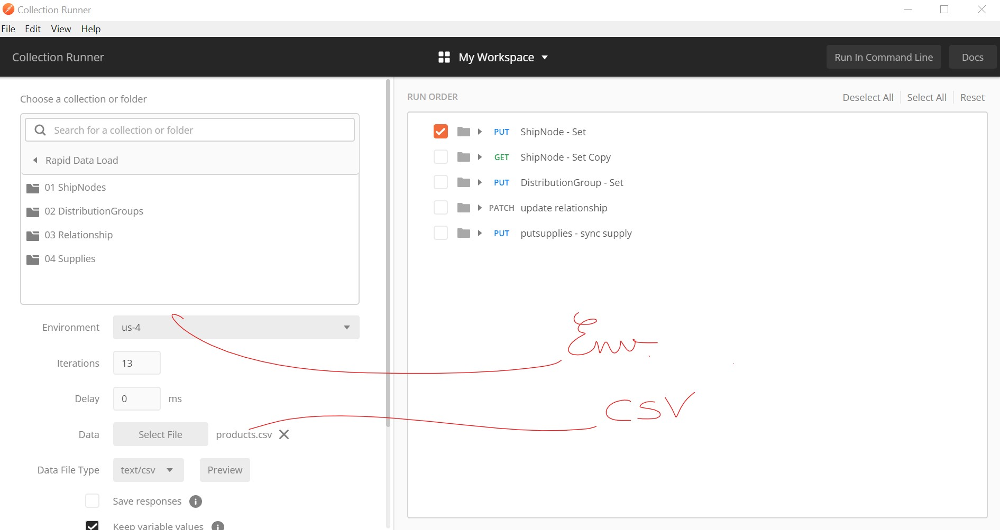

This is how to use the Postman Collection

1. Import Collection
2. Import Environment
3. Update Environment
4. Start Runner
5. Select Environment
6. Import shipnodes.csv file to create ship nodes
7. Import products.csv file to create relationships

